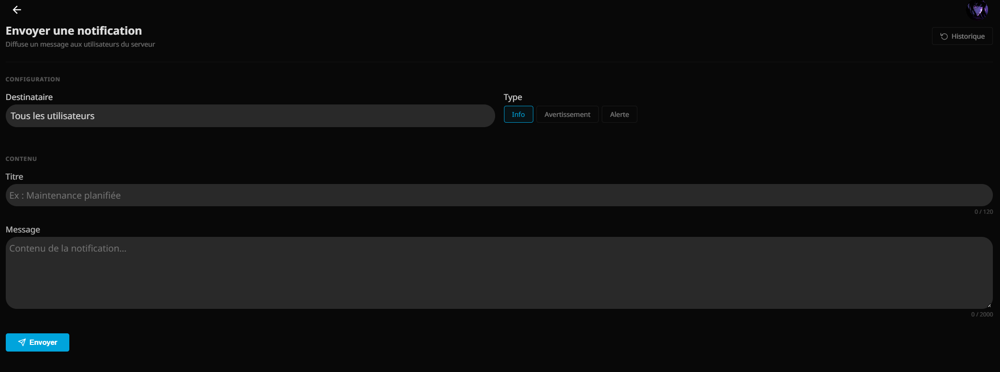
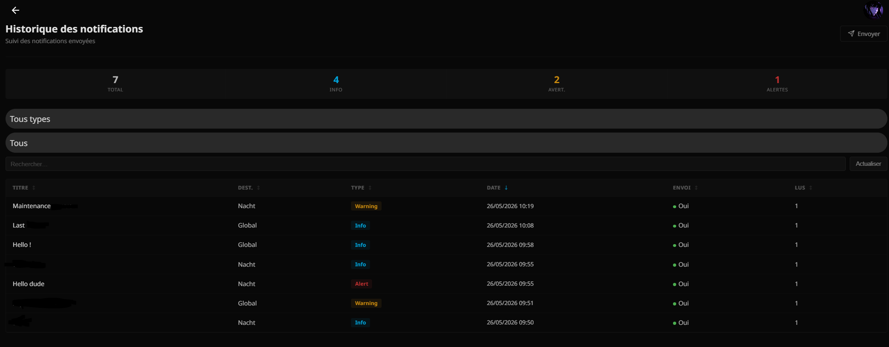
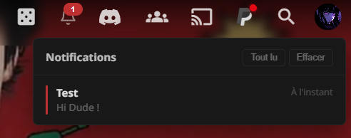
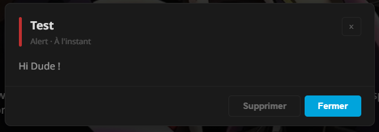

<p align="center">
  
</p>

<h1 align="center">Jellyfin Notification</h1>

<p align="center">
  <strong>Custom notification system for Jellyfin</strong><br>
  <em>Targeted push, real-time WebSocket delivery, native bell UI, admin dashboard</em>
</p>

<p align="center">
  
  
  
  
</p>

---

## Features

| Feature | Description |
|---|---|
| **Bell icon** | Integrated in the Jellyfin navigation bar with unread badge counter |
| **Real-time push** | Notifications pushed via native WebSocket (`ISessionManager`) — instant toast |
| **Dropdown panel** | Lists notifications with type indicators, date, preview text |
| **Client-side dismiss** | Each notification can be individually dismissed with animation |
| **Detail modal** | Full view with type indicator, date, formatted content |
| **User targeting** | Send to all users or to a specific one |
| **Admin dashboard** | Send and History pages with filters, sort, statistics |
| **SQLite persistence** | WAL mode database, configurable auto-purge |
| **Fallback polling** | If push fails, the client recovers via polling (60s) |


## Screenshots


### Send Notification



### Notification History



### Notification Bell



### Notification Detail


---

## Installation

### Method 1 — Download release

1. Download the latest release from [Releases](../../releases)
2. Extract to Jellyfin plugins directory:
   - **Windows (service)**: `C:\ProgramData\Jellyfin\Server\plugins\Jellyfin_notification_X.X.X.X\`
   - **Windows (tray)**: `%LOCALAPPDATA%\jellyfin\plugins\Jellyfin_notification_X.X.X.X\`
   - **Linux**: `/var/lib/jellyfin/plugins/Jellyfin_notification_X.X.X.X/`
3. Restart Jellyfin

### Method 2 — Build from source

#### Prerequisites

- [.NET SDK 9.0](https://dotnet.microsoft.com/download/dotnet/9.0)
- [Jellyfin Server 10.11.x](https://jellyfin.org/downloads/)
- PowerShell (for automated Windows deployment)

#### Build

```bash
git clone https://github.com/your-user/jellyfin-notification.git
cd jellyfin-notification
dotnet build -c Release
```

#### Automated deployment (Windows)

```powershell
# Run in admin PowerShell
.\deploy.ps1 -Version "2.3.0.0"
```

The script handles: build, stop Jellyfin, cleanup old versions, copy DLL + meta.json, inject `<script>` into `index.html`.

> If the stop fails (access denied), stop Jellyfin manually then re-run the script.

---

## Architecture

```
jellyfin-notification/
├── Plugin.cs                     # Entry point — script injection, IHasWebPages
├── PluginServiceRegistrar.cs     # DI registration (Singleton)
│
├── Controllers/
│   ├── NotificationController.cs # REST API: Send, List, MarkAsRead, History
│   └── ClientScriptController.cs # Serves client JS (/JellyNotif/client)
│
├── Services/
│   └── NotificationService.cs    # Business logic — Outbox pattern
│
├── Data/
│   ├── NotificationDbContext.cs   # SQLite schema init + connection factory
│   └── NotificationRepository.cs  # Async CRUD
│
├── Models/
│   └── NotificationModels.cs      # Entities, DTOs, requests
│
├── Configuration/
│   └── PluginConfiguration.cs     # MaxNotifications, RetentionDays
│
├── ClientScript/
│   └── notif-client.js            # Client UI — bell, panel, modal
│
├── Pages/
│   ├── send.html                  # Admin: send form
│   └── history.html               # Admin: history table
│
├── deploy.ps1                     # Automated deployment
└── meta.json                      # Jellyfin plugin metadata
```

### Data flow

```
Admin (send.html)
  |  POST /Notification/Send
  v
NotificationController -> NotificationService.SendAsync()
  |                           |
  +-- INSERT SQLite           +-- Push WebSocket (ISessionManager)
  |   via Repository          |   -> native Jellyfin toast
  |                           |
  +-- UPDATE IsSent ----------+
                                    
Client (notif-client.js)  <-- Polling 60s (fallback)
  |  GET /Notification/List
  v
Bell panel
```

---

## REST API

| Method | Route | Auth | Description |
|--------|-------|------|-------------|
| `POST` | `/Notification/Send` | Admin | Create and push a notification |
| `GET` | `/Notification/List` | User | Current user's notifications |
| `POST` | `/Notification/MarkAsRead/{id}` | User | Mark as read |
| `GET` | `/Notification/Admin/History` | Admin | Full history (dashboard) |
| `GET` | `/JellyNotif/client` | Public | Client JS script |

### Example — Send a notification

```bash
curl -X POST http://localhost:8096/Notification/Send   -H "Authorization: MediaBrowser Token="YOUR_TOKEN""   -H "Content-Type: application/json"   -d '{
    "title": "Scheduled maintenance",
    "message": "The server will restart at 11pm.",
    "targetUserId": "All",
    "type": "Warning"
  }'
```

---

## Configuration

| Option | Type | Default | Description |
|--------|------|---------|-------------|
| `MaxNotifications` | int | 200 | Maximum notifications stored |
| `RetentionDays` | int | 30 | Auto-delete after N days (0 = disabled) |

---

## Security

- **Authentication**: Jellyfin claims (`Jellyfin-UserId`) with fallback `NameIdentifier` / `sub`
- **Admin authorization**: `RequiresElevation` policy on sensitive endpoints
- **Strict validation**: Title max 120 chars, Message max 2000, TargetUserId = `All` or valid GUID, Type whitelist
- **Anti-XSS**: `escHtml()` with full `& < > " '` escaping on client
- **Anti-SQL injection**: 100% parameterized queries
- **Connection string**: Built via `SqliteConnectionStringBuilder`
- **Thread-safety**: Lazy init with `volatile` + `Interlocked.CompareExchange`

---

## Contributing

Contributions welcome. See [CONTRIBUTING.md](CONTRIBUTING.md) for guidelines.

## License

Distributed under the [MIT License](LICENSE).

## Changelog

See [CHANGELOG.md](CHANGELOG.md) for full history.
